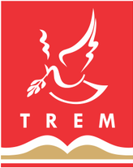

<div id="top"></div>

<!-- [![Contributors][contributors-shield]][contributors-url]
[![Forks][forks-shield]][forks-url]
[![Stargazers][stars-shield]][stars-url]
[![Issues][issues-shield]][issues-url] -->

<!-- [![MIT License][license-shield]][license-url] -->

[![LinkedIn][linkedin-shield]][linkedin-url]

<!-- PROJECT LOGO -->
<br />
<div align="center">
  <a href="https://github.com/kelzvictoria/workers-attendance-client">
    
  </a>

  <h3 align="center">Workers Attendance Management System</h3>

  <!-- <p align="center">
    An awesome README template to jumpstart your projects!
    <br />
    <a href="https://github.com/othneildrew/Best-README-Template"><strong>Explore the docs »</strong></a>
    <br />
    <br />
    <a href="https://github.com/othneildrew/Best-README-Template">View Demo</a>
    ·
    <a href="https://github.com/othneildrew/Best-README-Template/issues">Report Bug</a>
    ·
    <a href="https://github.com/othneildrew/Best-README-Template/issues">Request Feature</a>
  </p> -->
</div>

<!-- TABLE OF CONTENTS -->
<details>
  <summary>Table of Contents</summary>
  <ol>
    <li>
      <a href="#about-the-project">About The Project</a>
      <ul>
        <li><a href="#built-with">Built With</a></li>
      </ul>
    </li>
    <li>
      <a href="#getting-started">Getting Started</a>
      <ul>
        <li><a href="#prerequisites">Prerequisites</a></li>
        <li><a href="#installation">Installation</a></li>
      </ul>
    </li>
    <!-- <li><a href="#usage">Usage</a></li> -->
    <li><a href="#roadmap">Roadmap</a></li>
    <!-- <li><a href="#contributing">Contributing</a></li> -->
    <!-- <li><a href="#license">License</a></li> -->
    <li><a href="#contact">Contact</a></li>
    <li><a href="#acknowledgments">Acknowledgments</a></li>
  </ol>
</details>

<!-- ABOUT THE PROJECT -->

## About The Project

[![Attenders Management System Screen Shot][project-screenshot]](https://github.com/kelzvictoria/workers-attendance-client)

I built this web application for my Church, TREM Ejigbo to digitize the Workers' Meeting Attendance data collation process.

<p align="right">(<a href="#top">back to top</a>)</p>

### Built With

- [React.js](https://reactjs.org/)
- [Redux.js](https://redux.js.org/)

<p align="right">(<a href="#top">back to top</a>)</p>

<!-- GETTING STARTED -->

## Getting Started

### Prerequisites

- npm
  ```sh
  npm install npm@latest -g
  ```

### Installation

1. Clone the repo
   ```sh
   git clone https://github.com/kelzvictoria/workers-attendance-client
   ```
2. Install NPM packages
   ```sh
   npm install
   ```

<p align="right">(<a href="#top">back to top</a>)</p>

<!-- USAGE EXAMPLES -->

<!-- ## Usage

<p align="right">(<a href="#top">back to top</a>)</p>

ROADMAP -->

## Roadmap

- [x] Implement Authentication
- [x] Manage Workers (Create, Edit, Asssign Role, Delete, View)
- [x] Manage Ministry Arms (Workers belong to Ministry Arms)
- [x] Manage Directorates ( Ministry Arms belong to Directorates)
- [x] Manage Users (Create, Edit, Delete, Assign Role, View)
- [x] Manage Attendance (Create, View, Edit, Delete)
- [x] Mange Camp Meeting Registrations

<!-- CONTRIBUTING -->
<!--
## Contributing

Contributions are what make the open source community such an amazing place to learn, inspire, and create. Any contributions you make are **greatly appreciated**.

If you have a suggestion that would make this better, please fork the repo and create a pull request. You can also simply open an issue with the tag "enhancement".
Don't forget to give the project a star! Thanks again!

1. Fork the Project
2. Create your Feature Branch (`git checkout -b feature/AmazingFeature`)
3. Commit your Changes (`git commit -m 'Add some AmazingFeature'`)
4. Push to the Branch (`git push origin feature/AmazingFeature`)
5. Open a Pull Request

<p align="right">(<a href="#top">back to top</a>)</p> -->

<!-- LICENSE -->

<!-- ## License

Distributed under the MIT License. See `LICENSE.txt` for more information.

<p align="right">(<a href="#top">back to top</a>)</p> -->

<!-- CONTACT -->

## Contact

Victoria Kazeem - [@vickycinky](https://twitter.com/vickycinky) - kelzvictoria@gmail.com

<p align="right">(<a href="#top">back to top</a>)</p>

<!-- ACKNOWLEDGMENTS -->

## Acknowledgments

- [Ant Design](https://ant.design/)

<p align="right">(<a href="#top">back to top</a>)</p>

<!-- MARKDOWN LINKS & IMAGES -->
<!-- https://www.markdownguide.org/basic-syntax/#reference-style-links -->

<!-- [license-url]: https://github.com/othneildrew/Best-README-Template/blob/master/LICENSE.txt -->

[linkedin-shield]: https://img.shields.io/badge/-LinkedIn-black.svg?style=for-the-badge&logo=linkedin&colorB=555
[linkedin-url]: https://linkedin.com/in/victoria-kazeem-062708bb/
[project-screenshot]: project.png
